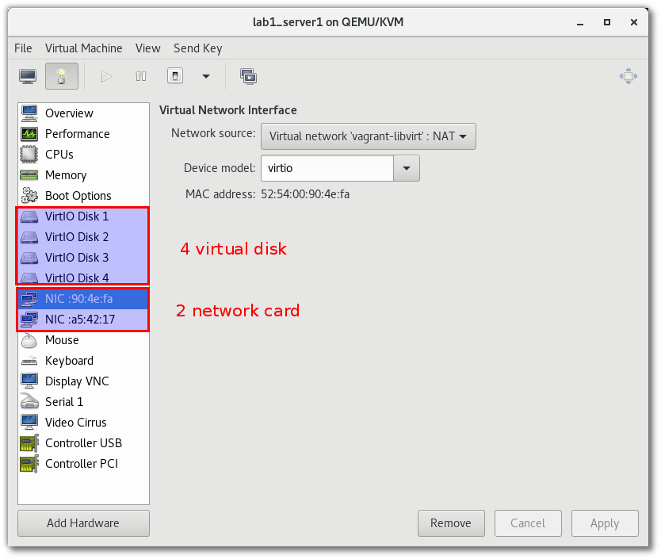

====================
Build Infrastructure
====================

Vagrant
=======
การใช้งาน vagrant เพื่อสร้าง development environment

.. image:: _images/vagrant001.png

.. seealso::

   * `vagrant by hasicorp <https://www.vagrantup.com/>`_;
   * `vagrant libvirt เพื่อดู config <https://github.com/vagrant-libvirt/vagrant-libvirt>`_;

Install vagrant
***************
การติดตั้ง vagrant จะแตกต่างกันระหว่าง os ขั้นตอนต่อไปนี้เป็นการติดตั้ง vagrant บน Fedora 24
::

	sudo dnf group install "C Development Tools and Libraries"
	sudo dnf install  ruby-devel zlib-devel
	sudo dnf install  libxslt  libxslt-devel  libxml2  libxml2-devel redhat-lsb
	sudo dnf install libxslt-devel libxml2-devel libvirt-devel libguestfs-tools-c ruby-devel
	sudo dnf install redhat-rpm-config patch
	sudo gem install nokogiri -v '1.6.8'
	wget https://releases.hashicorp.com/vagrant/1.8.4/vagrant_1.8.4_x86_64.rpm
	sudo dnf install vagrant_1.8.4_x86_64.rpm

ติดตั้ง plugin เพื่มเติิมสำหรับ libvirt
::

	vagrant plugin install vagrant-libvirt
	vagrant plugin install vagrant-scp

repository
----------
vagrant ได้เตรียม image ไว้มากมายเพื่อให้เราสามารถใช้งาน ได้ โดยสามารถค้นหาและdownload image
เพื่อเตรียมทดสอบ https://atlas.hashicorp.com/boxes/search

.. image:: _images/vagrant002.png

อีกที่หนึ่ง http://www.vagrantbox.es/

Download box
------------
.. note::

  การสั่งคำสั่ง vagrant cli สามารถใช้งาน ใน user ปรกติไม่จำเป็น root โดย vagrant จะสร้าง directory
  ให้ที่ $HOME/.vagrant.d/

::

	$ vagrant box add centos/7
	==> box: Loading metadata for box 'centos/7'
		box: URL: https://atlas.hashicorp.com/centos/7
	This box can work with multiple providers! The providers that it
	can work with are listed below. Please review the list and choose
	the provider you will be working with.

	1) libvirt
	2) virtualbox

	Enter your choice:

add box อื่น ยกตัวอย่างเช่น::

    vagrant box add fedora/24-cloud-base
    vagrant box add ubuntu/trusty64
    vagrant box add debian/jessie64

สร้าง project directory เพื่อการทดสอบ ชื่อ ``project01`` และ download vagrant box
::

	$ mkdir project01
	$ cd project01
	$ vagrant init centos/7
	$ cat Vagrantfile
	(result เมื่อลบ comment ออก)
	# -*- mode: ruby -*-
	# vi: set ft=ruby :

	Vagrant.configure("2") do |config|
	  config.vm.box = "centos/7"
	end

	$ vagrant up --provider libvirt

คำสั่ง vagrant init จะสร้าง Vagrantfile ต้นแบบ เนื้อหาใน file ส่วนมากเป็นตัวอย่าง config การ
ใช้งาน บน virtualbox แต่ในการทดสอบนี้จะทำการสร้าง VM บน KVM hypervisor โดยตรง ที่ผ่านมาจึง
ต้องทำการติดตั้ง plugin ชื่อ ``vagrant-libvirt``

เพิ่มเติม vagrantfile ด้านล่าง

.. literalinclude::  _source/Vagrantfile1

.. image:: _images/vagrant004.png

กดเลือก double click lab1_server1  (lab1 ชื่อ  project directory และ server1 เป็น ชื่อ VM)

.. image:: _images/vagrant005.png

กดเลือก รูปหลอดไฟเพื่อดูรายละเดียด

Connect to VM
-------------
สามารถเชื่อมผ่าน vagrant ssh [ชื่อ server] โดยที่ชื่อ ของ Server จะเป็นค่าที่กำหนดแก่ ``define``
::

  vagrant ssh server1
  vagrant ssh server2

File System Synce
-----------------
vagrant ได้ทำการ sync file system ให้ระหว่าง host และ vm ผ่านทาง ``/home/vagrant/sync``
ทำให้ vm สามารถใช้งาน file จากภายนอกได้โดยตรง แต่ถ้าหากมีการเปลี่ยนแปลง  file ใน host จะ
ต้องสั่ง ``vagrant reload`` ก่อนการใช้งาน  vm
