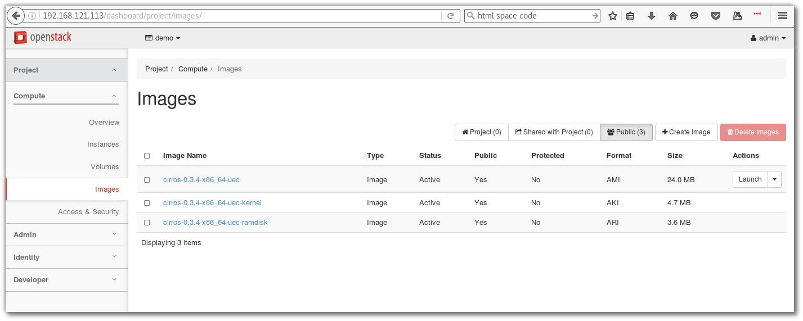

=======================
Openstack With DevStack
=======================

Devstack with Vagrant
=====================
file vagrant สำหรับการทดสอบ devstack

.. literalinclude::  _source/Vagrantfile2

Download complete file :download:`Vagrantfile2 <./_source/Vagrantfile2>`::

Install Devstack
****************

หลังจาก ที่เราได้ทำการ vagrant up server1 เรียบร้อยแล้ว vm นี้มีขนาด RAM  8 Gb เพื่อใช้การทดสอบ
openstack ทดสอบโดยการสร้าง Directory สำหรับการทดสอบ ``Devstack`` และ ให้ Download หรือ สร้าง
file Vagrant จากตัวอย่างด้านบน
::

  mkdir ~/Devstack
  cd ~/Devstack
  wget https://thaiopen.github.io/sipacloudcourse/_downloads/Vagrantfile2
  mv Vagrantfile2 Vagrantfile

  ## ssh to vagrant
  vagrant ssh server1

  ## change to root
  sudo su -
  useradd -d /opt/stack stack
  echo "stack ALL=(ALL) NOPASSWD: ALL" >> /etc/sudoers
  exit

  ## on normal vagrant user
  sudo dnf install git
  git clone https://git.openstack.org/openstack-dev/devstack
  cd devstack
  ## create local.conf
  cat << LOCAL > local.conf
  [[local|localrc]]
  ADMIN_PASSWORD=password
  DATABASE_PASSWORD=password
  RABBIT_PASSWORD=password
  SERVICE_PASSWORD=password
  LOCAL

  ## run stack.sh
  ./stack.sh

ผลลัพท์ที่ได้::

  =========================
  DevStack Component Timing
  =========================
  Total runtime         3780

  run_process            41
  pip_install           535
  restart_apache_server   8
  wait_for_service       10
  yum_install           181
  git_timed             2075
  =========================

  This is your host IP address: 192.168.121.113
  This is your host IPv6 address: ::1
  Horizon is now available at http://192.168.121.113/dashboard
  Keystone is serving at http://192.168.121.113/identity/
  The default users are: admin and demo
  The password: password
  2016-07-19 10:32:41.679 | WARNING:
  2016-07-19 10:32:41.679 | Using lib/neutron-legacy is deprecated, and it will be removed in the future
  2016-07-19 10:32:41.679 | stack.sh completed in 3780 seconds.

เปิด browser ไปยัง http://192.168.121.113/dashboard

login ด้วย admin/password

Manage Devstack
***************
เนื่องจาก devstack run service ต่างๆ ใน screen session ไม่มี service command สำหรับการ start stop
ัดังนั้นจะต้องเข้าไปใน screen session มีขั้นตอนดังนี้::

  screen -list

  There is a screen on:
  	28843.stack	(Detached)
  1 Socket in /var/run/screen/S-vagrant.

จะพบว่ามี screen session ชื่อ stack run อยู่::

  screen -x stack

หลังจาก run แล้ว จะเข้าสู่ session ของ screen ดังรูปด้านล่าง ซึ่งจะต้องใช้คำสั่งในการจัดการ โดยให้พิมพ์คำสั่ง
ขึ้นต้นด้วย ``Ctrl+b`` แล้วตามด้วยค่าต่างๆ

คำสั่งแสดง list ทั้งหมด::

  Ctrl a "  (กด ctrl a แล้วปล่อย จากนั้นตามด้วย ")

เลือก process::

  *. เลื่อน cursor ไปยัง process ที่ต้องการ แล้วจึงกด ``enter``เพื่อเลือกไปดู process เช่น เลือนไปยัง
  process  2 ซึ่งเป็น process ของ keystone  ``enter``  เพื่อทำการ monitor ใหัสังเกตุดูบรรทัดล่างสุด
  จะมี เครื่องหมาย ``*``

  .. image:: _images/devstack05.png
  
  *. สามารถกด ``Ctrl a N`` โดยที่ N หมายถึงหมายเลข ของ process จะทำให้เข้าไปยัง process นั้นทันที
