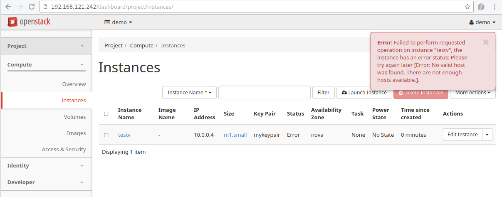

=======================
Openstack With DevStack
=======================

*********************
Devstack with Vagrant
*********************
file vagrant สำหรับการทดสอบ devstack

.. literalinclude::  _source/Vagrantfile2

Download complete file :download:`Vagrantfile2 <./_source/Vagrantfile2>`::

เตรียมเครื่อง host ให้สนับสนุน nested kvm เนื่องจากเรากำลังสร้าง openstack ซ้อนใน VM ทำดังต่อไปนี้
::

  vi /etc/modprobe.d/kvm-nested.conf
  options kvm_intel nested=1
  modprobe -r kvm_intel
  modprobe kvm_intel
  reboot

Install Devstack
================

หลังจาก ที่เราได้ทำการ vagrant up server1 เรียบร้อยแล้ว vm นี้มีขนาด RAM  8 Gb เพื่อใช้การทดสอบ
openstack ทดสอบโดยการสร้าง Directory สำหรับการทดสอบ ``Devstack`` และ ให้ Download หรือ สร้าง
file Vagrant จากตัวอย่างด้านบน
::

  mkdir ~/Devstack
  cd ~/Devstack
  wget https://thaiopen.github.io/sipacloudcourse/_downloads/Vagrantfile2
  mv Vagrantfile2 Vagrantfile

  ## ssh to vagrant
  vagrant ssh devstack

  ## check vm support virtualization
  egrep -c '(vmx|svm)' /proc/cpuinfo
  2

  ## change to root
  sudo su -
  useradd -d /opt/stack stack
  echo "stack ALL=(ALL) NOPASSWD: ALL" >> /etc/sudoers
  exit

  ## on normal vagrant user
  sudo dnf update -y
  sudo dnf install git -y
  git clone https://git.openstack.org/openstack-dev/devstack
  cd devstack
  ## create local.conf
  cat << LOCAL > local.conf
  [[local|localrc]]
  ADMIN_PASSWORD=password
  DATABASE_PASSWORD=password
  RABBIT_PASSWORD=password
  SERVICE_PASSWORD=password
  LOCAL

  ## run stack.sh
  ./stack.sh

script ``stack.sh`` จะทำการ download source code จาก github และมาติดตั้งให้เองอัตโนมัติ
โดยdownload มาเก็บไปใน ``/opt/stack`` และผลลัพท์ที่ได้ จะสามารถใช้งาน openstack ได้ทันที::

  =========================
  DevStack Component Timing
  =========================
  Total runtime         3780

  run_process            41
  pip_install           535
  restart_apache_server   8
  wait_for_service       10
  yum_install           181
  git_timed             2075
  =========================

  This is your host IP address: 192.168.121.113
  This is your host IPv6 address: ::1
  Horizon is now available at http://192.168.121.113/dashboard
  Keystone is serving at http://192.168.121.113/identity/
  The default users are: admin and demo
  The password: password
  2016-07-19 10:32:41.679 | WARNING:
  2016-07-19 10:32:41.679 | Using lib/neutron-legacy is deprecated, and it will be removed in the future
  2016-07-19 10:32:41.679 | stack.sh completed in 3780 seconds.

เปิด browser ไปยัง http://192.168.121.113/dashboard

.. image:: _images/devstack01.png

login ด้วย admin/password

.. image:: _images/devstack02.png

Error
-----
เมื่อทำการทดสอบ การสร้าง Instance จะเกิด error::

  Error: Failed to perform requested operation on instance "testv",
  the instance has an error status: Please try again later
  [Error: No valid host was found. There are not enough hosts available.].

ให้ทำการแก้ไขด้วยการ เพิ่ม ค่าตัวแปรใน ``/etc/nova/nova.conf``
::

  sudo vim /etc/nova/nova.conf
  ## Add these two lines
  ram_allocation_ratio=2
  cpu_allocation_ratio=20
  ## Default value here is 16

Manage Devstack
===============
เนื่องจาก devstack run service ต่างๆ ใน screen session ไม่มี service command สำหรับการ start stop
ัดังนั้นจะต้องเข้าไปใน screen session มีขั้นตอนดังนี้::

  screen -list

  There is a screen on:
  	28843.stack	(Detached)
  1 Socket in /var/run/screen/S-vagrant.

จะพบว่ามี screen session ชื่อ stack run อยู่::

  screen -x stack

หลังจาก run แล้ว จะเข้าสู่ session ของ screen ดังรูปด้านล่าง ซึ่งจะต้องใช้คำสั่งในการจัดการ โดยให้พิมพ์คำสั่ง
ขึ้นต้นด้วย ``Ctrl+b`` แล้วตามด้วยค่าต่างๆ

.. image:: _images/devstack03.png

คำสั่งแสดง list ทั้งหมด::

  Ctrl a "  (กด ctrl a แล้วปล่อย จากนั้นตามด้วย ")

.. image:: _images/devstack04.png

เลือก process::

  *. เลื่อน cursor ไปยัง process ที่ต้องการ แล้วจึงกด ``enter``เพื่อเลือกไปดู process เช่น เลือนไปยัง
  process  2 ซึ่งเป็น process ของ keystone  ``enter``  เพื่อทำการ monitor ใหัสังเกตุดูบรรทัดล่างสุด
  จะมี เครื่องหมาย ``*`` รูปด้านล่าง
  *. สามารถกด ``Ctrl a N`` โดยที่ N หมายถึงหมายเลข ของ process จะทำให้เข้าไปยัง process นั้นทันที

ออกจาก stack::

  screen -d

Add Devstack plugin
===================
สามารถทำได้ด้วยการ เพิ่มเติมค่าใน local.conf

.. literalinclude::  _source/local.conf2

Download complete file :download:`local.conf2<./_source/local.conf2>`::

หลังจากแก้ไขค่าแล้ว ให้ สั่งคำสั่งดังนี้ ::

  ./unstack.sh
  vi local.conf
  ./stack.sh

.. note:: ค่าที่อยู่ใน local.conf เป็นการสั่งให้ติดตั้ง service และ plugin แต่ยังไม่มีการ preconfig
devstack จะทำการสร้าง network ไว้ให้เป็นตัวอย่างที่ 10.0.0.0/24

หลังจากที่สำเร็จ จะได้ผลลัพท์::

  =========================
  DevStack Component Timing
  =========================
  Total runtime         2872

  run_process           103
  test_with_retry         3
  pip_install           314
  restart_apache_server  19
  wait_for_service       14
  yum_install           182
  git_timed             1006
  =========================

  This is your host IP address: 192.168.121.113
  This is your host IPv6 address: ::1
  Horizon is now available at http://192.168.121.113/dashboard
  Keystone is serving at http://192.168.121.113:5000/v3/
  The default users are: admin and demo
  The password: password
  2016-07-19 13:29:54.781 | WARNING:
  2016-07-19 13:29:54.781 | Using lib/neutron-legacy is deprecated, and it will be removed in the future
  2016-07-19 13:29:54.781 | stack.sh completed in 2872 seconds.

ทดสอบ  ``screen -x stack`` และ list ด้วย ``Ctrl a "``

.. image:: _images/devstack06.png

ทดสอบโดย browser ``http://192.168.121.113/dashboard`` เพื่อดูเมนู ที่เปลี่ยนไป จากรูปจะเห็นค่า
config ของ network ที่ devstack เตรียมไว้ให้

Network Menu

.. image:: _images/devstack07.png

Heat Orchestration Menu

.. image:: _images/devstack8.png

Compute Menu

.. note::

  เมื่อเสร็จแล้วต้องการ สิ้นสุด ให้ ``./unstack.sh`` ทุกครั้ง แล้วค่อย stack.sh ใหม่

::

  Ctrl a d      (exit from screen session)
  ./unstack.sh

Neutron Network Default Settings
================================

ค่า default ของ network ที่สร้างหลังจาก ที่ enable neutron โดยมี openswitch เป็นคนสร้างให้ เป็นค่า
default เนื่องจากเราไม่ได้ปรับแต่ค่าตัวแปรใดๆใน local.conf ให้พิมพ์คำสั่ง openvswitch ``ovs-vsctl show``::

  sudo ovs-vsctl show
  66a8c5c3-6f2c-41a3-9756-9ac89faf1628
      Manager "ptcp:6640:127.0.0.1"
          is_connected: true
      Bridge br-ex
          Port "qg-237cb003-ee"
              Interface "qg-237cb003-ee"
                  type: internal
          Port br-ex
              Interface br-ex
                  type: internal
      Bridge br-tun
          Controller "tcp:127.0.0.1:6633"
              is_connected: true
          fail_mode: secure
          Port br-tun
              Interface br-tun
                  type: internal
          Port patch-int
              Interface patch-int
                  type: patch
                  options: {peer=patch-tun}
      Bridge br-int
          Controller "tcp:127.0.0.1:6633"
              is_connected: true
          fail_mode: secure
          Port br-int
              Interface br-int
                  type: internal
          Port "tap7ee7f8f3-62"
              tag: 1
              Interface "tap7ee7f8f3-62"
                  type: internal
          Port "qr-d9f37ff9-d4"
              tag: 1
              Interface "qr-d9f37ff9-d4"
                  type: internal
          Port "qr-d7da2f54-f0"
              tag: 1
              Interface "qr-d7da2f54-f0"
                  type: internal
          Port patch-tun
              Interface patch-tun
                  type: patch
                  options: {peer=patch-int}
      ovs_version: "2.5.0"

ดู interface ด้วย ip link::

  $ ip link
  1: lo: <LOOPBACK,UP,LOWER_UP> mtu 65536 qdisc noqueue state UNKNOWN mode DEFAULT group default qlen 1
      link/loopback 00:00:00:00:00:00 brd 00:00:00:00:00:00
  2: eth0: <BROADCAST,MULTICAST,UP,LOWER_UP> mtu 1500 qdisc fq_codel state UP mode DEFAULT group default qlen 1000
      link/ether 52:54:00:19:c1:e0 brd ff:ff:ff:ff:ff:ff
  3: ovs-system: <BROADCAST,MULTICAST> mtu 1500 qdisc noop state DOWN mode DEFAULT group default qlen 1
      link/ether 1e:33:d0:b4:57:f9 brd ff:ff:ff:ff:ff:ff
  4: br-tun: <BROADCAST,MULTICAST> mtu 1500 qdisc noop state DOWN mode DEFAULT group default qlen 1
      link/ether ae:0f:68:a5:a6:48 brd ff:ff:ff:ff:ff:ff
  7: br-int: <BROADCAST,MULTICAST> mtu 1500 qdisc noop state DOWN mode DEFAULT group default qlen 1
      link/ether 8a:24:e0:d5:03:42 brd ff:ff:ff:ff:ff:ff
  9: br-ex: <BROADCAST,MULTICAST,UP,LOWER_UP> mtu 1500 qdisc noqueue state UNKNOWN mode DEFAULT group default qlen 1
      link/ether fe:8e:5d:8c:1c:40 brd ff:ff:ff:ff:ff:ff
  11: virbr0: <NO-CARRIER,BROADCAST,MULTICAST,UP> mtu 1500 qdisc noqueue state DOWN mode DEFAULT group default qlen 1000
      link/ether 52:54:00:e8:8c:c7 brd ff:ff:ff:ff:ff:ff
  12: virbr0-nic: <BROADCAST,MULTICAST> mtu 1500 qdisc fq_codel master virbr0 state DOWN mode DEFAULT group default qlen 1000
      link/ether 52:54:00:e8:8c:c7 brd ff:ff:ff:ff:ff:ff
