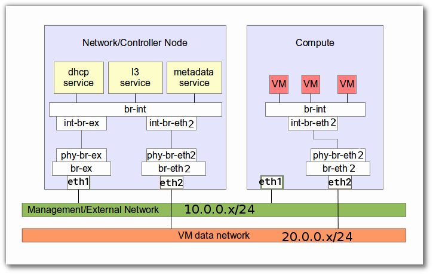
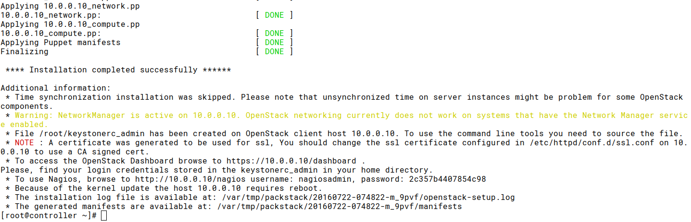

========================
Openstack with Packstack
========================
*********
packstack
*********

vagrant
=======
สร้าง directory ชื่อ openstack และภายในมี Vagrantfile ดังนี้

.. literalinclude::  _source/Vagrantfile3

Download complete file :download:`Vagrantfile3 <./_source/Vagrantfile3>`

เข้าไปยัง controller
::
    mkdir ~/packstack
    cd packstack
    wget https://thaiopen.github.io/sipacloudcourse/_downloads/Vagrantfile3
    mv Vagrantfile3 Vagrantfile

    vagrant up --no-parallel
    vagrant ssh controller

    #test ping to compute, selinux, network
    ping compute
    getenforce
    systemctl is-active NetworkManager
    systemctl is-active firewalld

Disk prepare for cinder
-----------------------
เตรียม disk ให้กับ cinder ด้วยการสร้าง volume group ชื่อว่า  cinder-volumes
::

    sudo su -
    fdisk -l
    ...
    Disk /dev/vdb: 21.5 GB, 21474836480 bytes, 41943040 sectors
    Units = sectors of 1 * 512 = 512 bytes
    Sector size (logical/physical): 512 bytes / 512 bytes
    I/O size (minimum/optimal): 512 bytes / 512 bytes
    ...

    ##use /dev/vdb
    pvcreate /dev/vdb
    vgcreate cinder-volumes /dev/vdb

Install Packstack 2 way
-----------------------
การติดตั้ง Openstack ด้วย packstack เป็นการติดตั้งบน Redhat, CentOS7, Fedora โดยมีเบื้องหลังการ
ติดตั้งโดยการใช้ puppet module สามารถติดตั้ง packstack ได้ 2 วิธี

Method1
^^^^^^^
ติดตั้งผ่าน repository::

    sudo su -
    yum install -y openstack-packstack

Method2
^^^^^^^
ติดตั้งผ่าน source code (https://github.com/openstack/packstack)::

    sudo su -
    yum install git -y
    git clone git://github.com/openstack/packstack.git

    ##Follow activity
    cd packstack
    git log
    git checkout -b mystack

    #install python dependency
    yum install python-pip python-devel -y
    yum groupinstall "Development Tools" -y
    yum install libffi-devel openssl-devel

    #install
    python setup.py install
    ...
    Using /usr/lib/python2.7/site-packages
    Finished processing dependencies for packstack===8.0.0.0rc1.dev114.gae579f6

หลังจากติดตั้ง packstack ทั้งสองวิธีแล้ว จะมี คำสั่ง ``packstack`` สำหรับการติดตั้ง openstack
โดยจะสร้าง answerfile มาแล้วทำการแก้ไข::

    #go back to /root
    cd ~

    ## generate answer file with
    packstack --gen-answer-file "answer-$(date +%b-%d-%y).txt"
    ls  answer-*.txt

    ## packstack จะใช้ ip ของ eth0 เป็น ip ของ Management ip ของ openstack แต่เราจะใช้
    ## ip ของ eth1 แทน
    ## check ip in answerfile

    grep HOSTS answer-Jul-21-16.txt
    CONFIG_COMPUTE_HOSTS=192.168.121.9
    CONFIG_NETWORK_HOSTS=192.168.121.9

    ## ดูค่า ip ของ eth0, eth1

    ip -4 a show eth0 | awk '/inet/ {print $2;}'
    192.168.121.9/24
    ip -4 a show eth1 | awk '/inet/ {print $2;}'
    10.0.0.10/24

    ## การแก้ไขด้วยการใช้คำสั่ง ``sed``

    sed -i.orig s/192.168.121.9/10.0.0.10/g  answer-Jul-21-16.txt

Edit Packstack Config
*********************
ไฟล์ answerfile นี้ สามารถแก้ไข และ run ซ้ำได้ แต่ห้าม generate ใหม่
::

	  ## ตัวอย่างการใช้คำสั่ง  grep เพื่อช่วยค้นหาคำ
    grep -n ADMIN_PW  answer-Jul-21-16.txt
    333:CONFIG_KEYSTONE_ADMIN_PW=password

    vim  answer-Jul-21-16.txt  +333

สรุป config เบื้องต้นสำหรับการปรับแต่ง::

    CONFIG_KEYSTONE_ADMIN_PW=password
    CONFIG_LBAAS_INSTALL=y
    CONFIG_NEUTRON_METERING_AGENT_INSTALL=y
    CONFIG_NEUTRON_FWAAS=y

    CONFIG_NEUTRON_ML2_TYPE_DRIVERS=vlan
    CONFIG_NEUTRON_ML2_TENANT_NETWORK_TYPES=vlan
    CONFIG_NEUTRON_ML2_VLAN_RANGES=physnet2:1:1000

    CONFIG_NEUTRON_OVS_BRIDGE_MAPPINGS=physnet2:br-eth2
    CONFIG_NEUTRON_OVS_BRIDGE_IFACES=br-ex:eth0,br-eth2:eth2
    CONFIG_HEAT_INSTALL=y

    CONFIG_HEAT_CFN_INSTALL=y
    CONFIG_TROVE_INSTALL=y
    CONFIG_HORIZON_SSL=y
    CONFIG_PROVISION_DEMO=n

การแก้ไขค่าจะใช้ crudini เป็นตัวช่วย::

    yum install crudini rubygems -y
    # name file may difference
    answerfile=answer-Jul-21-16.txt
    crudini --set $answerfile general CONFIG_KEYSTONE_ADMIN_PW password
    crudini --set $answerfile general CONFIG_LBAAS_INSTALL y
    crudini --set $answerfile general CONFIG_NEUTRON_METERING_AGENT_INSTALL y
    crudini --set $answerfile general CONFIG_NEUTRON_FWAAS y

    crudini --set $answerfile general CONFIG_NEUTRON_ML2_TYPE_DRIVERS vlan,vxlan,gre,flat,local
    crudini --set $answerfile general CONFIG_NEUTRON_ML2_TENANT_NETWORK_TYPES local,vlan,gre,vxlan

    crudini --set $answerfile general CONFIG_NEUTRON_ML2_VLAN_RANGES physnet2:1:1000

    crudini --set $answerfile general CONFIG_NEUTRON_OVS_BRIDGE_MAPPINGS ext-net:br-ex,physnet2:br-eth2
    crudini --set $answerfile general CONFIG_NEUTRON_OVS_BRIDGE_IFACES br-ex:eth0,br-eth2:eth2

    crudini --set $answerfile general CONFIG_HEAT_INSTALL y
    crudini --set $answerfile general CONFIG_TROVE_INSTALL y

    crudini --set $answerfile general CONFIG_HEAT_CFN_INSTALL y
    crudini --set $answerfile general CONFIG_HORIZON_SSL y
    crudini --set $answerfile general CONFIG_PROVISION_DEMO n
    crudini --set $answerfile general CONFIG_CINDER_VOLUMES_CREATE n

Install openstack puppet module
-------------------------------
::

    export GEM_HOME=/tmp/somedir
    gem install r10k
    ...
    Installing ri documentation for r10k-2.3.0
    16 gems installed

    ## go to packstack source
    cd ~/packstack
    /tmp/somedir/bin/r10k puppetfile install -v

จะเป็นการติดตั้ง puppet module
::

    INFO	 -> Updating module /usr/share/openstack-puppet/modules/aodh
    INFO	 -> Updating module /usr/share/openstack-puppet/modules/ceilometer
    INFO	 -> Updating module /usr/share/openstack-puppet/modules/cinder
    INFO	 -> Updating module /usr/share/openstack-puppet/modules/glance
    INFO	 -> Updating module /usr/share/openstack-puppet/modules/gnocchi
    INFO	 -> Updating module /usr/share/openstack-puppet/modules/heat
    INFO	 -> Updating module /usr/share/openstack-puppet/modules/horizon
    INFO	 -> Updating module /usr/share/openstack-puppet/modules/ironic
    INFO	 -> Updating module /usr/share/openstack-puppet/modules/keystone
    INFO	 -> Updating module /usr/share/openstack-puppet/modules/manila
    INFO	 -> Updating module /usr/share/openstack-puppet/modules/neutron
    INFO	 -> Updating module /usr/share/openstack-puppet/modules/nova
    INFO	 -> Updating module /usr/share/openstack-puppet/modules/openstack_extras
    INFO	 -> Updating module /usr/share/openstack-puppet/modules/openstacklib
    INFO	 -> Updating module /usr/share/openstack-puppet/modules/oslo
    INFO	 -> Updating module /usr/share/openstack-puppet/modules/sahara
    INFO	 -> Updating module /usr/share/openstack-puppet/modules/swift
    INFO	 -> Updating module /usr/share/openstack-puppet/modules/tempest
    INFO	 -> Updating module /usr/share/openstack-puppet/modules/trove
    INFO	 -> Updating module /usr/share/openstack-puppet/modules/vswitch
    INFO	 -> Updating module /usr/share/openstack-puppet/modules/apache
    INFO	 -> Updating module /usr/share/openstack-puppet/modules/certmonger
    INFO	 -> Updating module /usr/share/openstack-puppet/modules/concat
    INFO	 -> Updating module /usr/share/openstack-puppet/modules/firewall
    INFO	 -> Updating module /usr/share/openstack-puppet/modules/inifile
    INFO	 -> Updating module /usr/share/openstack-puppet/modules/memcached
    INFO	 -> Updating module /usr/share/openstack-puppet/modules/mongodb
    INFO	 -> Updating module /usr/share/openstack-puppet/modules/mysql
    INFO	 -> Updating module /usr/share/openstack-puppet/modules/nssdb
    INFO	 -> Updating module /usr/share/openstack-puppet/modules/rabbitmq
    INFO	 -> Updating module /usr/share/openstack-puppet/modules/redis
    INFO	 -> Updating module /usr/share/openstack-puppet/modules/remote
    INFO	 -> Updating module /usr/share/openstack-puppet/modules/rsync
    INFO	 -> Updating module /usr/share/openstack-puppet/modules/ssh
    INFO	 -> Updating module /usr/share/openstack-puppet/modules/stdlib
    INFO	 -> Updating module /usr/share/openstack-puppet/modules/sysctl
    INFO	 -> Updating module /usr/share/openstack-puppet/modules/vcsrepo
    INFO	 -> Updating module /usr/share/openstack-puppet/modules/xinetd

copy module::

    cp -r packstack/puppet/modules/packstack /usr/share/openstack-puppet/modules

Run
::

    cd /etc/pki/tls/certs/
    openssl req -x509 -sha256 -newkey rsa:2048 -keyout selfkey.key -out selfcert.crt -days 1024 -nodes
    ## answer question
    Country Name (2 letter code) [XX]:TH
    State or Province Name (full name) []:Bangkok
    Locality Name (eg, city) [Default City]:Bangkok
    Organization Name (eg, company) [Default Company Ltd]:MyOpenstack
    Organizational Unit Name (eg, section) []:ITDepartment
    Common Name (eg, your name or your server's hostname) []:controller.example.com
    Email Address []:admin@example.com
    Country Name (2 letter code) [XX]:TH
    State or Province Name (full name) []:Bangkok
    Locality Name (eg, city) [Default City]:Bangkok
    Organization Name (eg, company) [Default Company Ltd]:MyOpenstack
    Organizational Unit Name (eg, section) []:ITDepartment
    Common Name (eg, your name or your server's hostname) []:controller.example.com
    Email Address []:admin@example.com

    mv selfkey.key /etc/pki/tls/private/selfkey.key
    mkdir -p ~/packstackca/certs/

    cd ~
    packstack --answer-file answer-Jul-21-16.txt

    ## จะมี error แบบนี้
    Preparing Nova VNC Proxy entries                  [ ERROR ]
    ERROR : [Errno 2] No such file or directory: '~/packstackca/certs/10.0.0.10ssl_vnc.crt'

    ## copy key ``selfcert.crt`` from ``/etc/pki/tls/certs/`` to ``~/packstackca/certs/``
    ls /etc/pki/tls/certs/
    cp /etc/pki/tls/certs/ssl_vnc.crt ~/packstackca/certs/10.0.0.10ssl_vnc.crt

    ## edit path ``~/packstackca/`` to ``/root/packstackca/``
    grep -in  packstackca answer-Jul-22-16.txt
    249:CONFIG_SSL_CERT_DIR=~/packstackca/

    crudini --set  answer-Jul-22-16.txt general CONFIG_SSL_CERT_DIR /root/packstackca/

    ## run again
    packstack --answer-file answer-Jul-21-16.txt

ผลการ Run

Neutron Network
***************
.. note::
  เนื่องจากเป็นการทดสอบบน vagrant จึงใช้ eth0 สำหรับการเชื่อมต่อ internet เท่านั้น และใช้ eth0
  external network และ eth1 เป็น manament network ส่วน eth2 จะทำหน้าที่เป็น data-network

Openvswith จะทำหน้าที่สร้าง ระบบโครงสร้าง virtual network (ovs-system)ให้ ได้แก่ bridge ชื่อ
ิbr-ex, br-int, br-tun และ เราจะต้องเชื่อมต่อ bridge นี้กับ interface จริง ดังรูป

::

์Network Configuration ใน ``/etc/sysconfig/network-scripts/`` จะแสดงการเชื่อมต่อระหว่าง
br-ex <--> eth0
::

  cat ifcfg-br-ex
  ##
  ONBOOT="yes"
  PERSISTENT_DHCLIENT="yes"
  DEVICE=br-ex
  NAME=br-ex
  DEVICETYPE=ovs
  OVSBOOTPROTO="dhcp"
  TYPE=OVSBridge
  OVSDHCPINTERFACES=eth0
  OVS_EXTRA="set bridge br-ex other-config:hwaddr=52:54:00:ee:fe:49"

  cat ifcfg-eth0
  ##
  DEVICE=eth0
  NAME=eth0
  DEVICETYPE=ovs
  TYPE=OVSPort
  OVS_BRIDGE=br-ex
  ONBOOT=yes
  BOOTPROTO=none

และ br-eth2 <--> eth2
::

  cat ifcfg-br-eth2
  ##
  NM_CONTROLLED=no
  ONBOOT=yes
  IPADDR=20.0.0.10
  NETMASK=255.255.255.0
  PEERDNS=no
  DEVICE=br-eth2
  NAME=br-eth2
  DEVICETYPE=ovs
  OVSBOOTPROTO=none
  TYPE=OVSBridge

  cat ifcfg-eth2
  ##
  DEVICE=eth2
  NAME=eth2
  DEVICETYPE=ovs
  TYPE=OVSPort
  OVS_BRIDGE=br-eth2
  ONBOOT=yes
  BOOTPROTO=none

ตรวจสอบ interface ด้วยคำสั่ง ``ip link`` จะสังเกตุเห็น interface ที่ 5,7,9,11,11 เป็น ของ
openvswitch::

  ip link
  ##
  1: lo: <LOOPBACK,UP,LOWER_UP> mtu 65536 qdisc noqueue state UNKNOWN mode DEFAULT
      link/loopback 00:00:00:00:00:00 brd 00:00:00:00:00:00
  2: eth0: <BROADCAST,MULTICAST,UP,LOWER_UP> mtu 1500 qdisc pfifo_fast master ovs-system state UP mode DEFAULT qlen 1000
      link/ether 52:54:00:ee:fe:49 brd ff:ff:ff:ff:ff:ff
  3: eth1: <BROADCAST,MULTICAST,UP,LOWER_UP> mtu 1500 qdisc pfifo_fast state UP mode DEFAULT qlen 1000
      link/ether 52:54:00:7c:45:f8 brd ff:ff:ff:ff:ff:ff
  4: eth2: <BROADCAST,MULTICAST,UP,LOWER_UP> mtu 1500 qdisc pfifo_fast master ovs-system state UP mode DEFAULT qlen 1000
      link/ether 52:54:00:58:81:34 brd ff:ff:ff:ff:ff:ff
  5: ovs-system: <BROADCAST,MULTICAST> mtu 1500 qdisc noop state DOWN mode DEFAULT
      link/ether fa:c8:7d:8b:61:be brd ff:ff:ff:ff:ff:ff
  7: br-ex: <BROADCAST,MULTICAST,UP,LOWER_UP> mtu 1500 qdisc noqueue state UNKNOWN mode DEFAULT
      link/ether 52:54:00:ee:fe:49 brd ff:ff:ff:ff:ff:ff
  9: br-eth2: <BROADCAST,MULTICAST,UP,LOWER_UP> mtu 1500 qdisc noqueue state UNKNOWN mode DEFAULT
      link/ether 3a:95:42:99:3c:4d brd ff:ff:ff:ff:ff:ff
  10: br-int: <BROADCAST,MULTICAST> mtu 1500 qdisc noop state DOWN mode DEFAULT
      link/ether f2:75:a8:13:61:41 brd ff:ff:ff:ff:ff:ff
  11: br-tun: <BROADCAST,MULTICAST> mtu 1500 qdisc noop state DOWN mode DEFAULT
      link/ether 8e:3e:d4:03:64:4e brd ff:ff:ff:ff:ff:ff

ตรวจสอบด้วยคำสั่ง ``ovs-vsctl show``::

  ovs-vsctl show
  ##
  43a1c7ac-2a16-43c2-88d3-423334b04eea
      Bridge br-tun
          fail_mode: secure
          Port patch-int
              Interface patch-int
                  type: patch
                  options: {peer=patch-tun}
          Port br-tun
              Interface br-tun
                  type: internal
      Bridge br-ex
          Port br-ex
              Interface br-ex
                  type: internal
          Port "eth0"
              Interface "eth0"
          Port phy-br-ex
              Interface phy-br-ex
                  type: patch
                  options: {peer=int-br-ex}
      Bridge br-int
          fail_mode: secure
          Port patch-tun
              Interface patch-tun
                  type: patch
                  options: {peer=patch-int}
          Port int-br-ex
              Interface int-br-ex
                  type: patch
                  options: {peer=phy-br-ex}
          Port br-int
              Interface br-int
                  type: internal
          Port "int-br-eth2"
              Interface "int-br-eth2"
                  type: patch
                  options: {peer="phy-br-eth2"}
      Bridge "br-eth2"
          Port "phy-br-eth2"
              Interface "phy-br-eth2"
                  type: patch
                  options: {peer="int-br-eth2"}
          Port "eth2"
              Interface "eth2"
          Port "br-eth2"
              Interface "br-eth2"
                  type: internal
      ovs_version: "2.5.0"

upload image
------------
(packstack จะสร้าง ไฟล์ keystonerc_admin ใช้สำหรับการ login ทาง commandline)
::

  source keystonerc_admin
  curl http://download.cirros-cloud.net/0.3.4/cirros-0.3.4-x86_64-disk.img | glance \
         image-create --name='cirros image' --visibility=public --container-format=bare --disk-format=qcow2

	+------------------+--------------------------------------+
	| Property         | Value                                |
	+------------------+--------------------------------------+
	| checksum         | ee1eca47dc88f4879d8a229cc70a07c6     |
	| container_format | bare                                 |
	| created_at       | 2016-07-06T06:30:13Z                 |
	| disk_format      | qcow2                                |
	| id               | 52835f4d-90fc-4dfd-85bd-d56a4c886ed7 |
	| min_disk         | 0                                    |
	| min_ram          | 0                                    |
	| name             | cirros image                         |
	| owner            | 4b2f4b8359614a2d930802d428cef551     |
	| protected        | False                                |
	| size             | 13287936                             |
	| status           | active                               |
	| tags             | []                                   |
	| updated_at       | 2016-07-06T06:30:42Z                 |
	| virtual_size     | None                                 |
	| visibility       | public                               |
	+------------------+--------------------------------------+

centos7 image::

	curl http://cloud.centos.org/centos/7/images/CentOS-7-x86_64-GenericCloud-1606.qcow2 | glance image-create --name='centos7 image' --visibility=public --container-format=bare --disk-format=qcow2
